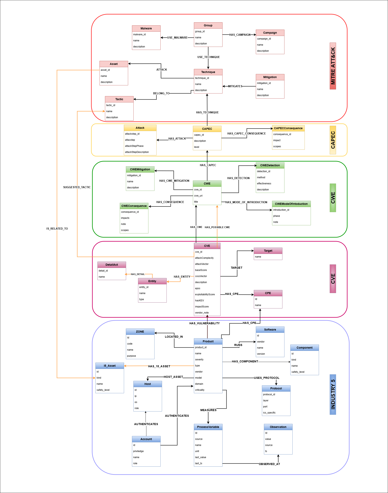
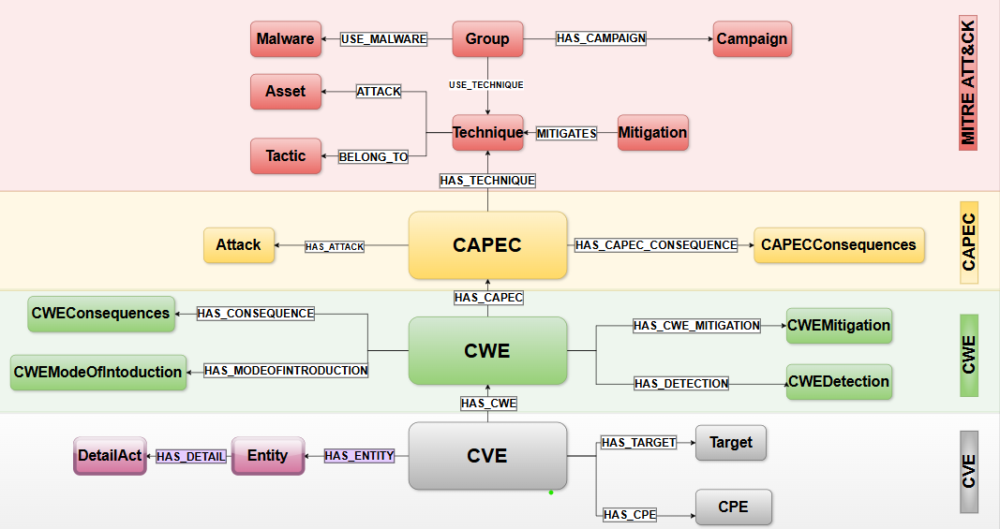
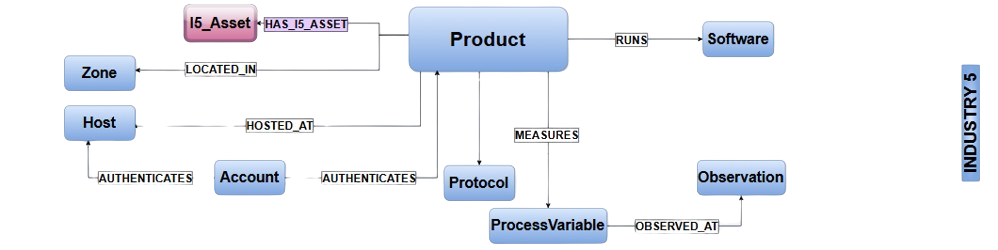
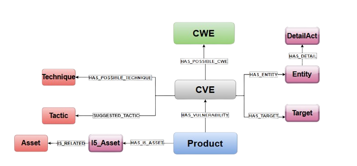

# Citation Note
If you use BRIDG-ICS datasets, KG schemas, enrichment pipelines, or threat reasoning modules, please cite:

Nandiya, P., Mohsin, A., Janicke, H., Ibrahim, A., & Sarker, I. H. (2025). BRIDG-ICS: An AI-grounded, Knowledge-Graph-driven framework for context-aware threat reasoning and cyber-resilience in Industry 5.0 systems

# BRIDG-ICS Knowledge Graph Overview
BRIDG-ICS integrates industrial assets, vulnerability taxonomies, adversarial behaviours, and operational dependencies into a unified Industrial Security Knowledge Graph.

  

## Intelligent Context Awware Knowledge Graph Structure
The BRIDG-ICS knowledge graph is constructed by combining three interconnected sub-graphs:

1. Vulnerability and Attack Taxonomies
This sub-graph connects standardized cybersecurity resources including CVE, CWE, CAPEC, and the MITRE ATT&CK framework.

  

2. ICS + Industry 5.0 Testbed Integration
The second sub-graph merges ICSA content with a local Industry 5.0 testbed, creating a more detailed representation of industrial assets and processes.

  

3. Enhanced Semantic Links
Finally, additional semantic relationships are added to enrich node connectivity and improve reasoning capabilities across the graph.

  

## Dataset 
1. MITRE ATT&CK: [Link](https://attack.mitre.org/resources/attack-data-and-tools/#excel-attack). Download all the XLSX files from both ICS and Enterprise.
2. CAPEC: [Link](https://capec.mitre.org/data/archive/capec_latest.zip)
3. CWE: [Link](https://cwe.mitre.org/data/xml/cwec_latest.xml.zip)
4. CVE: [Link](https://nvd.nist.gov/vuln/data-feeds). Download all zip from 2002-2025
5. ICSA: [Link](https://raw.githubusercontent.com/icsadvprj/ICS-Advisory-Project/main/ICS-CERT_ADV/CISA_ICS_ADV_Master.csv)
6. Local Dataset (Unpublished). Attribute: Dataflow, Product, zone, vulnerability.
7. Synthetic Dataset. The dataset can be seen in `Phase1/ Synthetic data` along with the explanations.

## How To Run
### Preprocessing
1. Put all the dataset from MITRE ATT&CK, NVD, CWE, CAPEC and ICSA in folder Uncleaned_data
2. Run The code in PreProcessing/Code to extract all the information needed into CSV files.

Notes: If you don't want to do the preprocessing, you can just go to Phase 1.

### Phase 1 - BRIDG-ICS KG
1. Open Neo4j and create instance
2. Put all the cleaned dataset into your import file in neo4j.
3. Run each query in Phase1/query to create the links.
4. Threat Analysis example can be done by running Threat-Analysis/cypher-example.txt on Neo4j.

All Cypher scripts for constructing and enriching the BRIDG-ICS Knowledge Graph are located in: Phase1-KG/cypher/
These scripts are intended to be executed on a Neo4j instance (with Graph Data Science (GDS) installed) to build the Industry 5.0 threat-analytics KG from the cleaned CSV datasets.

## Cypher Scripts Overview

Update the list below with your actual filenames in Phase1-KG/cypher:

- Phase1-KG/cypher/FILENAME_01_constraints.cypher
- Creates node labels, uniqueness constraints, and indexes for core KG entities (e.g., Product, CVE, CWE, CAPEC, Technique).
- Phase1-KG/cypher/FILENAME_02_load_nodes.cypher
Loads nodes from the cleaned CSV files (e.g., CVE, CWE, CAPEC, ATT&CK, ICSA, local testbed assets) into Neo4j.
Phase1-KG/cypher/FILENAME_03_load_relationships.cypher
Creates relationships between entities (e.g., HAS_CWE, HAS_CAPEC, HAS_TECHNIQUE, DEPLOYS, LOCATED_IN, COMMUNICATES_WITH), forming the core Industry 5.0 security KG.
Phase1-KG/cypher/FILENAME_04_semantic_enrichment.cypher
Adds LLM-/GDS-derived links (e.g., HAS_POSSIBLE_CWE, HAS_POSSIBLE_TECHNIQUE, HAS_POSSIBLE_COMMUNICATES_WITH) using similarity scores, classifier outputs, or embedding-driven link prediction.
Phase1-KG/cypher/FILENAME_05_threat_analysis_examples.cypher
Contains example queries for multi-hop reasoning, attack-path exploration, centrality analysis, and risk-ranking over the constructed KG.
You can adapt/expand this list as needed (e.g., separate files for ATT&CK, ICS testbed, or synthetic data).

